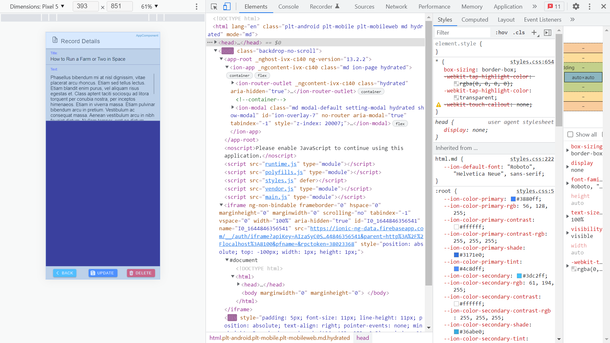

# :zap: Ionic Angular Firebase

* Ionic app to perform Create Read Update & Delete (CRUD) operations on a Google Cloud Firestore NoQSL document-oriented database.
* **Note:** to open web links in a new window use: _ctrl+click on link_


## :page_facing_up: Table of contents

* [:zap: Ionic Angular Firebase](#zap-ionic-angular-firebase)
  * [:page_facing_up: Table of contents](#page_facing_up-table-of-contents)
  * [:books: General info](#books-general-info)
  * [:camera: Screenshots](#camera-screenshots)
  * [:signal_strength: Technologies](#signal_strength-technologies)
  * [:floppy_disk: Setup](#floppy_disk-setup)
  * [:computer: Code Examples](#computer-code-examples)
  * [:cool: Features](#cool-features)
  * [:clipboard: Status & To-do list](#clipboard-status--to-do-list)
  * [:clap: Inspiration](#clap-inspiration)
  * [:file_folder: License](#file_folder-license)
  * [:envelope: Contact](#envelope-contact)

## :books: General info

* Firebase access was declined without some kind of access-limit script - see `Setup` below
* Each database record contains simple title & text strings with auto-generated record id string
* Typescript Record model used to specify record format
* Home page shows records from database as a list of Ionic cards
* Clicking on a card activates a modal with record details and cancel, update & delete buttons
* Data service separates logic that interacts with Firebase database
* Progressive Web App functionality added but needs to be tested

## :camera: Screenshots




## :signal_strength: Technologies

* [Ionic v6](https://ionicframework.com/)
* [Ionic/angular v6](https://ionicframework.com/)
* [Ionic icons](https://ionic.io/ionicons)
* [Angular v15](https://angular.io/)
* [Angular PWA](https://ionicframework.com/docs/angular/pwa) added
* [Angular Service-worker v14](https://www.npmjs.com/package/@angular/service-worker)
* [Firebase v9](https://firebase.google.com/)
* [@angular/fire v7](https://www.npmjs.com/package/@angular/fire) official Angular library for Firebase.
* [RxJS v7](https://reactivex.io/)
* [http-server](https://www.npmjs.com/package/http-server#available-options) static server to test PWA

## :floppy_disk: Setup

* Run `npm i` to install dependencies
* Create Google firebase project, create firestore database and add firebaseConfig data to `environment.ts` files, e.g.:
  
```typescript
export const environment = {
  production: false,
  firebase: {
    apiKey: 'xxx..x',
    authDomain: 'xxx..x',
    projectId: 'xxx..x',
    storageBucket: 'xxx..x',
    messagingSenderId: 'xxx..x',
    appId: 'xxx..x',
  },
};
```

* In Firebase click on 'Edit Rules' and change to allow access until up to a month from today, e.g.:

```firestore
service cloud.firestore {
  match /databases/{database}/documents {
    match /{document=**} {
      allow read, write: if request.time < timestamp.date(2022, 12, 12);
    }
  }
}
```

* Note: There are other ways to limit user access, including adding Firebase Authentication
* `ionic serve` To start the server on _localhost://8100_
* `ionic build --prod` to create build files in `www` folder
* `http-server www/` to serve static build files

## :computer: Code Examples

* `data.service.ts` constructor fetches all records with their ids from the Firebase 'records' collection of documents.

```typescript
  constructor(private db: AngularFirestore) {
    this.recordsCollection = db.collection<Record>('records');
    this.records = this.recordsCollection.snapshotChanges().pipe(
      map((actions) =>
        actions.map((record) =>
          // loop through each database item and return with id
          ({ id: record.payload.doc.id, ...record.payload.doc.data() })
        )
      )
    );
  }
```

## :cool: Features

* Simple code to access & perform CRUD operations on Firestore database
* Modal used to view record detail, instead of using routing to a record detail page

## :clipboard: Status & To-do list

* Status: Working
* To-do: Deploy

## :clap: Inspiration

* [How to implement an ionic modal controller in details](https://edupala.com/ionic-modal-controller-exmple/) for modal styling and size
* [Progressive Web Apps in Angular](https://ionicframework.com/docs/angular/pwa) includes deploying a PWA to Firebase

## :file_folder: License

* This project is licensed under the terms of the MIT license.

## :envelope: Contact

* Repo created by [ABateman](https://github.com/AndrewJBateman), email: gomezbateman@yahoo.com
