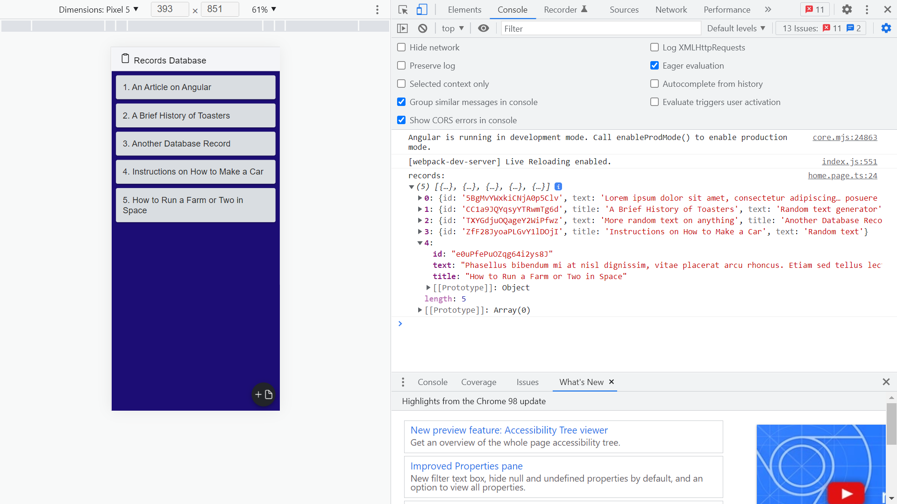

# :zap: Ionic Angular Firebase

* Ionic 5 app to perform Create Read Update & Delete (CRUD) operations on a Google Cloud Firestore NoQSL document-oriented database.
* **Note:** to open web links in a new window use: _ctrl+click on link_


## :page_facing_up: Table of contents

* [:zap: Ionic Angular Firestore](#zap-ionic-angular-firestore)
  * [:page_facing_up: Table of contents](#page_facing_up-table-of-contents)
  * [:books: General info](#books-general-info)
  * [:camera: Screenshots](#camera-screenshots)
  * [:signal_strength: Technologies](#signal_strength-technologies)
  * [:floppy_disk: Setup](#floppy_disk-setup)
  * [:computer: Code Examples](#computer-code-examples)
  * [:cool: Features](#cool-features)
  * [:clipboard: Status & To-do list](#clipboard-status--to-do-list)
  * [:clap: Inspiration](#clap-inspiration)
  * [:envelope: Contact](#envelope-contact)

## :books: General info

* I had to downgrade Typescript to v4.2.4 for code to work
* The FireStore 'Test Rules' were not available - see `Setup` below
* Each database record contains simple title & text strings with auto-generated record id
* Typescript Record model used to specify record format
* Home page shows records from database as a list of Ionic cards
* Data service separates logic that interacts with Firebase database

## :camera: Screenshots




## :signal_strength: Technologies

* [Ionic v5](https://ionicframework.com/)
* [Ionic/angular v5](https://ionicframework.com/)
* [Ionic icons](https://ionic.io/ionicons)
* [Angular v12](https://angular.io/)
* [Firebase v9](https://firebase.google.com/)
* [@angular/fire v7](https://www.npmjs.com/package/@angular/fire) official Angular library for Firebase.
* [RxJS v6](https://reactivex.io/)

## :floppy_disk: Setup

* Run `npm i` to install dependencies
* Create google firebase project, create firestore database and add data
* In Firebase click on 'Edit Rules' and change to allow access until up to a month from today, e.g.:

```
service cloud.firestore {
  match /databases/{database}/documents {
    match /{document=**} {
      allow read, write: if request.time < timestamp.date(2021, 11, 30);
    }
  }
}
```
* Note: There are other ways to limit user access, including adding Firebase Authentication
* To start the server on _localhost://8100_ type: 'ionic serve'

## :computer: Code Examples

* fetch all records as an observable Records array from the Firebase 'records' collection of documents.

```typescript
  getRecords(): Observable<Record[]> {
    const recordsRef = collection(this.firestore, 'records');
    return collectionData(recordsRef, { idField: 'id' }) as Observable<
      Record[]
    >;
  }
```

## :cool: Features

* Simple code to access & perform CRUD operations on Firestore database
* Modal used to view record detail, instead of using routing to a record detail page

## :clipboard: Status & To-do list

* Status: Working
* To-do: pwa, add authentication?

## :clap: Inspiration

* [How to implement an ionic modal controller in details](https://edupala.com/ionic-modal-controller-exmple/) for modal styling and size

## :file_folder: License

* This project is licensed under the terms of the MIT license.

## :envelope: Contact

* Repo created by [ABateman](https://github.com/AndrewJBateman), email: gomezbateman@yahoo.com
